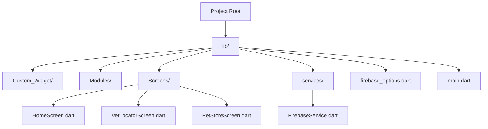

# 🐾 Vet-Store – Animal Care App  

A **Flutter & Firebase-powered** mobile app designed to make pet care simple and convenient.  
This project was developed as part of the **ITI Summer Training Final Project**.  

## 📌 Features  

✔️ **Pet Nutrition & Hydration** – Get expert guidance on feeding your pets  
✔️ **Find Nearby Veterinarians** – Locate and contact vets easily 🏥  
✔️ **Plan Adventurous Outings** – Organize exciting activities for your pets 🌳  
✔️ **Secure Authentication** – Login and manage your account 🔐  
✔️ **Seamless Shopping** – Buy high-quality pet products effortlessly 🛒  

## 📸 Screenshots  

  

## 🏗 Project Structure  



## 🚀 Getting Started  

### 📌 Prerequisites  

- Flutter SDK installed  
- Dart SDK installed  

### 📥 Installation  

1️⃣ Clone the repository:  
```sh
git clone https://github.com/engbasel/Vet-Store.git
```
2️⃣ Navigate to the project directory:  
```sh
cd Vet-Store
```
3️⃣ Install dependencies:  
```sh
flutter pub get
```
4️⃣ Run the app:  
```sh
flutter run
```

## 📂 APK Downloads  

📥 **Main APKs**: [Download Here](https://drive.google.com/drive/folders/1O6bwDWD5rqDHTzWNHCbdi6FX307Y0I04?usp=sharing)  
📥 **ITI Training Project Files**: [Download Here](https://drive.google.com/drive/folders/1fK8HOTNMrrdzG2emk48O4-I35EjhyqyZ?usp=sharing)  

## 🌐 Social Media  

🚀 Check out the **LinkedIn post** about this project:  
🔗 [View on LinkedIn](https://www.linkedin.com/posts/basel-embaby-948671227_flutter-firebase-animalcare-activity-7104851998054727680-Yewl)  

## 🤝 Contributors  

👨‍💻 **Basel Embaby**  
📧 [Email](mailto:basel.a.embaby@gmail.com)  
🔗 [LinkedIn](https://linkedin.com/in/basel-embaby)  
🐙 [GitHub](https://github.com/engbasel)  

## 📝 License  

📄 This project is licensed under the **MIT License** – see the [LICENSE](LICENSE) file for details.  
